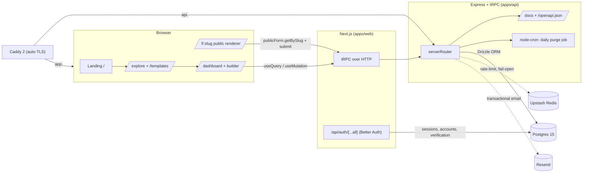
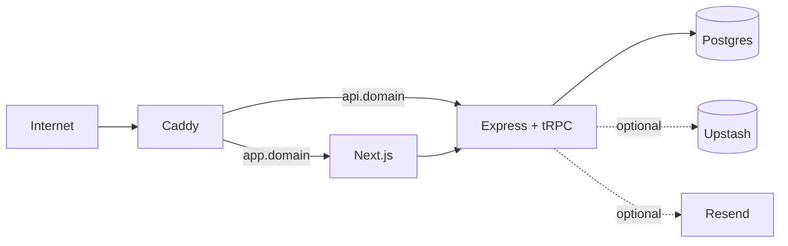

# Sensus

A form builder for people who care how it feels. Pick a mood, ask the
right questions, send a link. Sensus turns the form into a small
experience, instead of a grey wall of inputs.

> Forms with a feeling. Not just another input. Built so the people who
> answer have as good a time as the people who ask.

---

## Contents

1. [Demo](#1-demo)
2. [What you can do with it](#2-what-you-can-do-with-it)
3. [Architecture](#3-architecture)
4. [Stack](#4-stack)
5. [Repository layout](#5-repository-layout)
6. [Local development](#6-local-development)
7. [Environment variables](#7-environment-variables)
8. [Database, migrations, seeding](#8-database-migrations-seeding)
9. [API documentation](#9-api-documentation)
10. [Production deployment](#10-production-deployment)
11. [Testing and quality gates](#11-testing-and-quality-gates)
12. [Design decisions worth knowing](#12-design-decisions-worth-knowing)

---

## 1. Demo

|                  |                                          |
| ---------------- | ---------------------------------------- |
| **Live app**     | `https://app.<your-domain>`              |
| **API docs**     | `https://api.<your-domain>/docs`         |
| **OpenAPI spec** | `https://api.<your-domain>/openapi.json` |

### Demo credentials

These accounts are created by `pnpm db:seed-demo` and own the showcase
forms in the dashboard, `/explore`, and `/templates`.

| Role                                    | Email              | Password          |
| --------------------------------------- | ------------------ | ----------------- |
| Studio (owns the showcase forms)        | `demo@sensus.app`  | `SeeSensus!`      |
| Visiting judge (owns one unlisted form) | `judge@sensus.app` | `SeeSensus!`      |
| Local dev account                       | `dev@sensus.local` | `DevPassword123!` |

### What to look at, in order

1. Open the landing page. Hands raise and lower across the bottom band.
   Click any feature card.
2. Sign in as `demo@sensus.app`. The dashboard has six themed forms with
   real responses and views attached.
3. Open **Year-end favorites** → builder. Try the theme picker. Click
   **Preview** to see the form rendered through the same renderer the
   public sees, with `previewMode` on.
4. Visit `/explore`. The public showcase forms appear. Open one, fill it
   in, submit.
5. Back in the dashboard, open the same form's **Responses** and
   **Analytics** pages.

---

## 2. What you can do with it

- **Build a form** with ten field types: short text, long text, email,
  number, single select, multi select, checkbox, dropdown, rating, date.
  Each has per-type validation knobs (min/max, pattern, required, etc.).
- **Choose a layout**: one-per-screen (focused) or single-page
  (scrollable, optional page breaks via section flags).
- **Pick a theme** from ten curated presets (Pixel, Glitch, Terminal,
  Brutalist, Glassmorphism, Bauhaus, Museum, Vaporwave, Nature Minimal,
  Anime). The theme paints the public form end-to-end, including effects
  like scanlines, halftone, blur, grain.
- **Conditional logic**: show / hide / require / jump-to rules between
  fields and sections. Reactive on the client, re-validated on the
  server at submit time.
- **Preview before publish** at `/dashboard/forms/[id]/preview`. Same
  renderer as the live form, submit disabled.
- **Publish or unpublish** with a single click. **Public** forms appear
  in `/explore`; **unlisted** forms are reachable only via direct link.
- **Sections + drag reorder** in the builder via `@dnd-kit`. Move fields
  across sections, reorder either, with a soft-delete-aware backend.
- **Collect responses** without respondent login. Honeypot field for
  spam, sliding-window rate limit per form and global.
- **Read responses** in a table view, **download CSV**, watch **views,
  submits, completion rate, per-option distributions** in the analytics
  page, all from live SQL.
- **Templates** are public forms flagged by their owner. Anyone can
  clone a template into their own dashboard with one click.
- **Account deletion** soft-deletes the user and queues a daily purge
  job that hard-deletes 30 days later, walking the FK tree in reverse
  topological order in a single transaction.

---

## 3. Architecture



Every API request flows: **browser → Caddy → Express → tRPC middleware
chain → controller → service class → Drizzle → Postgres**. Errors thrown
inside services as typed classes (`FORM_NOT_FOUND`, `FORM_SCHEMA_LOCKED`,
`RATE_LIMIT_EXCEEDED`, etc.) are matched on their `code` field by a
service-error-mapper middleware and translated to TRPCError codes.

---

## 4. Stack

| Layer         | Choice                                                |
| ------------- | ----------------------------------------------------- |
| Monorepo      | Turborepo + pnpm workspaces                           |
| API           | Express 5 + tRPC 11                                   |
| API docs      | Scalar (`/docs`) + auto OpenAPI via `trpc-to-openapi` |
| Web           | Next.js 16 (App Router, Turbopack)                    |
| Auth          | Better Auth (email/password + Google OAuth)           |
| Database      | Postgres 15 + Drizzle ORM                             |
| Validation    | Zod, drizzle-zod                                      |
| UI            | shadcn primitives, Radix, Tailwind                    |
| Drag & drop   | @dnd-kit                                              |
| Motion        | motion (formerly framer-motion)                       |
| Charts        | Recharts                                              |
| Rate limit    | Upstash Redis (REST) with in-memory fallback          |
| Email         | Resend with mock-mode fallback (logs payload)         |
| Tests         | Vitest unit + integration, Playwright e2e             |
| Reverse proxy | Caddy 2 with automatic TLS                            |

---

## 5. Repository layout

```
sensus/
├── apps/
│   ├── api/             Express + tRPC + Scalar + node-cron purge
│   └── web/             Next.js 16 (App Router, Turbopack)
├── packages/
│   ├── auth/            Better Auth config (server + client)
│   ├── database/        Drizzle schema, db client, helpers, dev/demo seeds
│   ├── email/           React Email templates + Resend transport
│   ├── eslint-config/   Shared flat config
│   ├── logger/          Winston
│   ├── schemas/         drizzle-zod wire shapes + field-type catalog
│   ├── services/        Class-based business logic (form, field, section,
│   │                    condition, theme, response, analytics, rate-limit,
│   │                    account, purge)
│   ├── trpc/            Server router + controllers + middleware + client types
│   └── typescript-config/
├── docker-compose.yml             local Postgres only
├── docker-compose.prod.yml        full production stack
├── apps/api/Dockerfile
├── apps/web/Dockerfile
├── Caddyfile                      reverse proxy + TLS
├── .env.example
└── README.md
```

---

## 6. Local development

### Prerequisites

- Node 22+, pnpm 9
- Docker (for the local Postgres container)

### First run

```bash
git clone <repo-url> sensus
cd sensus

cp .env.example .env
# fill in BETTER_AUTH_SECRET, leave the rest as defaults for local dev
openssl rand -base64 32   # paste into BETTER_AUTH_SECRET

pnpm install
docker compose up -d              # postgres on :5432
pnpm db:migrate                   # apply Drizzle migrations
pnpm db:seed-dev                  # dev user + 10 theme presets
pnpm db:seed-demo                 # 6 showcase forms, 2 demo creators

pnpm dev                          # api :8000  +  web :3000
```

### Useful scripts

| Command             | Effect                                       |
| ------------------- | -------------------------------------------- |
| `pnpm dev`          | start api + web with hot reload              |
| `pnpm build`        | turbo build all apps                         |
| `pnpm test`         | Vitest across every package                  |
| `pnpm test:e2e`     | Playwright happy path (auto-starts services) |
| `pnpm lint`         | eslint with `--max-warnings 0`               |
| `pnpm check-types`  | tsc --noEmit, recursive                      |
| `pnpm db:generate`  | drizzle-kit generate (after editing models)  |
| `pnpm db:migrate`   | drizzle-kit migrate                          |
| `pnpm db:studio`    | drizzle-kit studio on :4983                  |
| `pnpm db:seed-dev`  | reset dev user + themes                      |
| `pnpm db:seed-demo` | seed showcase forms + demo creators          |

---

## 7. Environment variables

See `.env.example` for the full list. The minimum to run locally:

| Var                  | Why                                                          |
| -------------------- | ------------------------------------------------------------ |
| `DATABASE_URL`       | Postgres connection string                                   |
| `BETTER_AUTH_SECRET` | Session signing key. Generate with `openssl rand -base64 32` |
| `BETTER_AUTH_URL`    | Origin Better Auth runs at. Defaults to web app's origin.    |

Optional, all gracefully fall back when unset:

| Var                                         | Fallback                                          |
| ------------------------------------------- | ------------------------------------------------- |
| `GOOGLE_CLIENT_ID` / `GOOGLE_CLIENT_SECRET` | Google sign-in button is hidden                   |
| `UPSTASH_REDIS_REST_URL` / `..._TOKEN`      | Rate limit uses an in-memory sliding window       |
| `RESEND_API_KEY` / `RESEND_FROM`            | Email service logs the payload instead of sending |
| `CLOUDINARY_URL`                            | Image uploads stay disabled                       |

---

## 8. Database, migrations, seeding

- Models live in `packages/database/models/*.ts`. Edit a model →
  `pnpm db:generate` → review the new migration in
  `packages/database/drizzle/` → `pnpm db:migrate`.
- Every domain table carries `deletedAt`. Every read filters via the
  shared `notDeleted()` helper. Unique columns (`user.email`,
  `forms.slug`, `form_invites.token_hash`, `themes.key`) use partial
  unique indexes so soft-deleted rows do not squat on identifiers.
- All foreign keys are `ON DELETE RESTRICT`. The only place that issues
  hard `DELETE` is the daily Purge job (`apps/api/src/jobs/purge.cron.ts`),
  which walks the FK tree in reverse topological order inside a single
  transaction.
- **Dev seed** (`pnpm db:seed-dev`): creates the local dev user + the
  ten theme presets. Idempotent.
- **Demo seed** (`pnpm db:seed-demo`): creates the two demo creators and
  six themed showcase forms with realistic responses and views.
  Idempotent (skips forms that already exist).

---

## 9. API documentation

The API self-documents two ways:

- **Scalar UI**: `http://localhost:8000/docs` (browseable, lets you try
  endpoints directly)
- **OpenAPI JSON**: `http://localhost:8000/openapi.json` (machine
  readable, generated from the tRPC router via `trpc-to-openapi`)

In production these live at `https://api.<your-domain>/docs` and
`/openapi.json`.

---

## 10. Production deployment

The full stack runs in four containers behind Caddy:



### 10.1 Prerequisites

- A Linux VPS (e.g. Hostinger, 2 GB RAM minimum)
- A registered domain with two A records:
  - `app.<your-domain>` → VPS IP
  - `api.<your-domain>` → VPS IP
- Docker + Docker Compose on the VPS
- Ports 80 and 443 open in the firewall

### 10.2 First deploy

```bash
# on the VPS
git clone <repo-url> /opt/sensus
cd /opt/sensus

cp .env.example .env
# Edit .env:
#   DOMAIN=your-domain.tld
#   ADMIN_EMAIL=admin@your-domain.tld
#   POSTGRES_PASSWORD=$(openssl rand -base64 24)
#   BETTER_AUTH_SECRET=$(openssl rand -base64 32)
#   BETTER_AUTH_URL=https://app.your-domain.tld
#   WEB_ORIGIN=https://app.your-domain.tld
#   NEXT_PUBLIC_API_URL=https://api.your-domain.tld/trpc
#   NEXT_PUBLIC_AUTH_URL=https://app.your-domain.tld

docker compose -f docker-compose.prod.yml build
docker compose -f docker-compose.prod.yml up -d

# Apply migrations + seed once Postgres is healthy
docker compose -f docker-compose.prod.yml exec api \
  node -e "require('child_process').execSync('pnpm db:migrate', { stdio: 'inherit' })"
docker compose -f docker-compose.prod.yml exec api \
  node -e "require('child_process').execSync('pnpm db:seed-dev && pnpm db:seed-demo', { stdio: 'inherit' })"
```

Caddy will provision TLS certificates for both subdomains on the first
inbound request. Watch `docker compose logs -f caddy` until you see the
ACME challenge succeed.

### 10.3 Updating

```bash
git pull
docker compose -f docker-compose.prod.yml build
docker compose -f docker-compose.prod.yml up -d
```

### 10.4 Google OAuth callback in production

If you configured Google sign-in, add a second authorised redirect URI
in the Google Cloud Console:

```
https://app.<your-domain>/api/auth/callback/google
```

### 10.5 Resend deliverability (when you turn email on)

Add these DNS records once you flip `RESEND_API_KEY` on:

- `DKIM`: provided by the Resend dashboard, CNAME record
- `SPF`: TXT record `v=spf1 include:_spf.resend.com ~all`
- `DMARC`: TXT record at `_dmarc.<your-domain>` →
  `v=DMARC1; p=quarantine; rua=mailto:postmaster@<your-domain>`

---

## 11. Testing and quality gates

CI (`.github/workflows/ci.yml`) runs on every push:

```
lint  →  check-types  →  test  →  build  →  db:migrate  →  db:seed-dev  →  e2e
```

| Suite              | Where                                                      | What                                                       |
| ------------------ | ---------------------------------------------------------- | ---------------------------------------------------------- |
| Unit + integration | Vitest, every package                                      | service layer, evaluator, drizzle invariants, tRPC callers |
| End-to-end         | Playwright, `apps/web`                                     | one happy path: builder → publish → submit → thanks        |
| Local 4-gate       | `pnpm lint && pnpm check-types && pnpm test && pnpm build` | mirrors CI minus e2e                                       |

A `pre-push` Husky hook runs the 4-gate locally so failures don't reach
CI.

---

## 12. Design decisions worth knowing

Each of these is intentional. The full reasoning lives alongside the
code, but here is the punch list:

- **Class-based services.** Every domain has a service class
  (`FormService`, `FieldService`, `SectionService`, `ConditionService`,
  `ResponseService`, `AnalyticsService`, `ThemeService`, `RateLimitService`,
  `AccountService`, `PurgeService`). Constructors take the db handle for
  test isolation. Methods take an args-object, never positional args.
- **No `!` non-null assertions, no unsafe `as`.** Enforced by ESLint.
  Narrow with checks or parse with Zod.
- **Universal soft delete.** Every domain row has `deletedAt`. Every
  read filters with `notDeleted()`. Hard delete is the purge job only.
- **No SQL cascade.** All FKs are `ON DELETE RESTRICT`. The purge job
  walks the FK tree explicitly in a single transaction.
- **Optimistic concurrency.** Every mutation that changes form schema
  increments `forms.version`. Mismatched versions throw
  `FORM_VERSION_MISMATCH → CONFLICT`.
- **Schema lock after publish.** Once published, fields/sections/options
  freeze. Theme + visibility + layout remain mutable as metadata.
- **Stateless API.** Every API instance holds no per-process state.
  Rate limit counters and sessions live in Postgres / Upstash.
- **Public-form typed states.** `publicForm.getBySlug` resolves to
  `ready | not_found | unpublished | archived | rate_limited` and the
  renderer paints each as a themed `<UnavailableState>` variant.
- **Fail open on Upstash.** When the rate limiter cannot reach Upstash,
  it logs a warning and lets the request through. The product stays up
  even when the limiter dies.
- **Mock-mode email + rate limit.** Both services have a no-config local
  fallback so the demo runs without external accounts. Setting the env
  var flips them to real.
- **One renderer for live + preview.** `<FormRenderer>` takes a
  `previewMode` flag. Preview reuses the exact same code path that the
  live form does, so there is zero risk of "looked fine in preview,
  broke in prod".

---

Built with care. Use it kindly.
